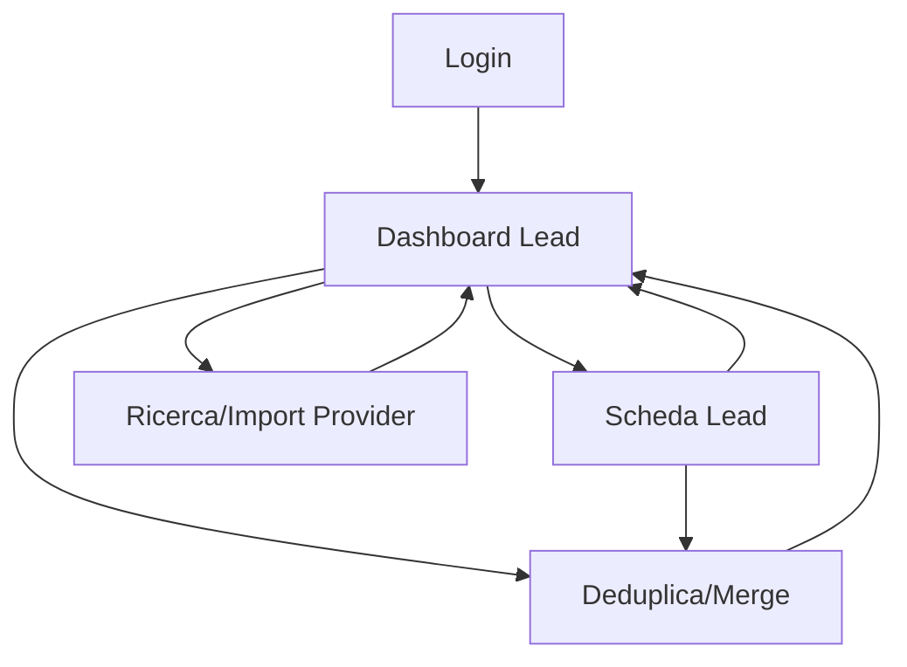

## 1. Product Overview
FoodLead Engine è un MVP per cercare, importare e gestire lead B2B nel settore food a partire da provider esterni.
Offre una dashboard operativa con CRUD, filtri, scoring e deduplica/merge per ottenere rapidamente una lista contatti “pronta per sales”.

## 2. Core Features

### 2.1 User Roles
| Ruolo | Metodo registrazione | Core Permissions |
|------|-----------------------|------------------|
| Operatore | Invito (creato da Admin) + login email/password | Cerca/importa lead da provider, gestisce lead (CRUD), usa filtri, vede scoring, esegue deduplica/merge |
| Admin | Primo utente o invito elevato | Tutto come Operatore + gestisce provider (config/attivazione), regole di scoring e deduplica |

### 2.2 Feature Module
Le funzionalità MVP consistono nelle seguenti pagine principali:
1. **Login**: autenticazione, recupero accesso.
2. **Dashboard Lead**: ricerca/import da provider, lista lead con filtri, scoring, deduplica; (solo Admin) gestione provider e regole (scoring/deduplica) come sezione interna alla dashboard.
3. **Scheda Lead**: dettaglio lead, modifica campi, tracciabilità sorgenti/provider, merge duplicati.

### 2.3 Page Details
| Page Name | Module Name | Feature description |
|-----------|-------------|---------------------|
| Login | Autenticazione | Eseguire login con email/password; avviare reset password via email; gestire errori di credenziali e sessione scaduta. |
| Dashboard Lead | Ricerca/Import provider-based | Selezionare provider e parametri di ricerca; avviare ricerca; mostrare anteprima risultati; importare in elenco lead salvati; indicare stato (in corso/completato/fallito). |
| Dashboard Lead | Lista lead + CRUD veloce | Visualizzare tabella lead; aprire scheda lead; creare lead manuale; modificare campi principali inline o via azione rapida; archiviare/eliminare lead. |
| Dashboard Lead | Filtri e segmentazione | Filtrare per stato, tags, area geografica, categoria/settore, fonte/provider, presenza contatti (email/telefono), range scoring; ordinare per scoring/recency; salvare un “filtro rapido” (solo per utente). |
| Dashboard Lead | Scoring | Calcolare e mostrare punteggio lead (0–100) e motivazioni principali (es. completezza contatto, match ICP, freschezza); ricalcolare punteggio dopo modifica dati/import. |
| Dashboard Lead | Deduplica | Identificare duplicati durante import e su richiesta; mostrare gruppi duplicati; proporre record “master”; consentire merge manuale con regole di priorità (campo per campo). |
| Dashboard Lead | Amministrazione (solo Admin) | Configurare/abilitare provider (credenziali, limiti operativi); definire regole base di scoring e di deduplica; salvare modifiche e renderle effettive per le nuove importazioni/ricalcoli. |
| Scheda Lead | Dettaglio e modifica | Mostrare profilo lead (azienda/contatto, canali, note, tags); modificare e salvare; validare formati (email, telefono, URL); evidenziare campi mancanti. |
| Scheda Lead | Sorgenti e tracciabilità | Mostrare da quali provider/sorgenti arriva il lead, con timestamp e payload essenziale; consentire re-import/refresh (se supportato dal provider). |
| Scheda Lead | Gestione duplicati/merge | Visualizzare possibili duplicati del lead; confrontare record; eseguire merge e mantenere audit minimo (chi/quando). |

## 3. Core Process
**Flusso Operatore**
1. Effettui login.
2. Apri la Dashboard Lead e selezioni un provider.
3. Imposti filtri di ricerca (es. categoria, area, dimensione azienda) e lanci la ricerca.
4. Valuti risultati, importi i lead utili.
5. Il sistema calcola scoring e segnala duplicati; tu confermi deduplica/merge quando necessario.
6. Applichi filtri/sort in lista, apri una Scheda Lead per completare dati e note.

**Flusso Admin**
1. Effettui login.
2. Nella Dashboard Lead apri la sezione Admin e configuri/abiliti provider (credenziali, limiti) e definisci regole base di scoring e deduplica.
3. Controlli qualità: ricalcoli scoring, affini regole in base ai risultati e al tasso di duplicati.

