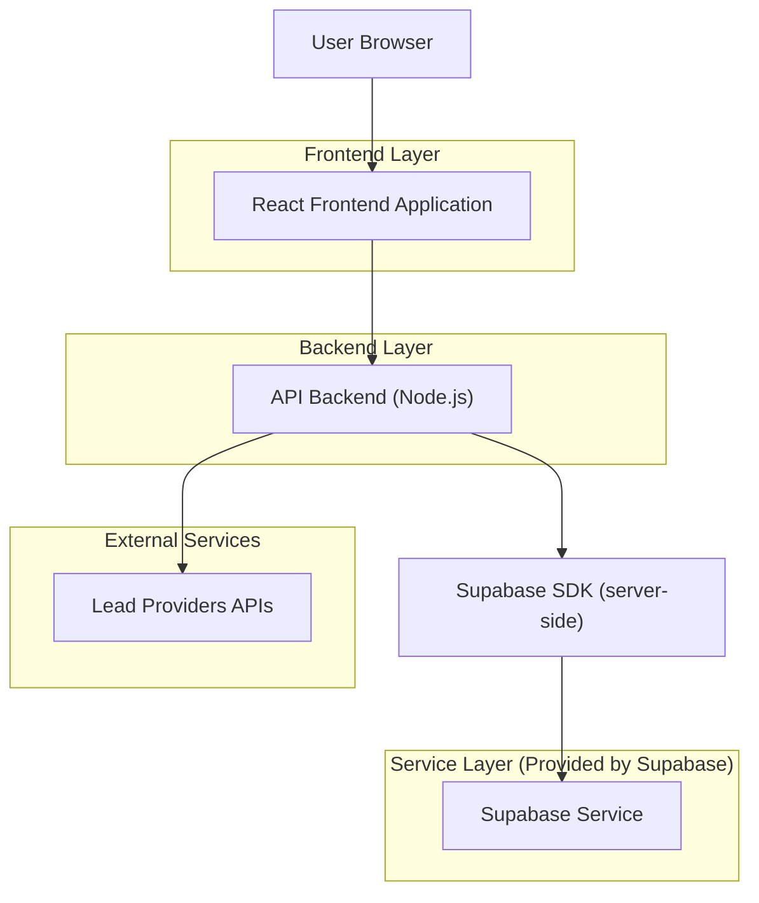
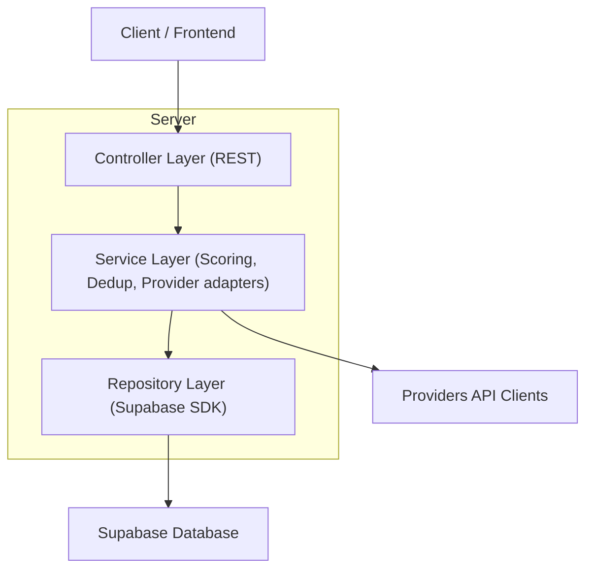
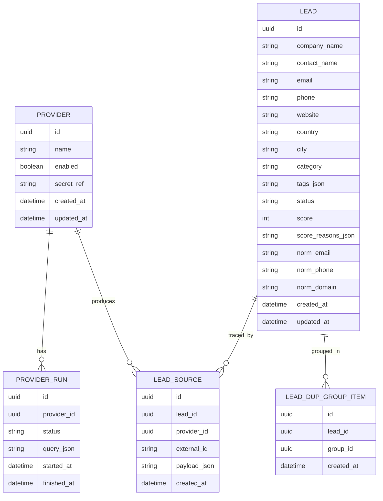

## 1.Architecture design


## 2.Technology Description
- Frontend: React@18 + TypeScript + vite + tailwindcss@3
- Backend: Node.js (Express@4) + TypeScript
- Database/Auth: Supabase (PostgreSQL + Supabase Auth)

Nota vincoli: Supabase viene integrato **solo nel backend** (server-side) via SDK; il frontend chiama esclusivamente le API del backend.

## 3.Route definitions
| Route | Purpose |
|-------|---------|
| /login | Login e recupero accesso |
| /leads | Home post-login: dashboard lead (ricerca/import, lista, filtri, scoring, deduplica) |
| /leads/:id | Scheda lead (dettaglio, modifica, merge duplicati) |

## 4.API definitions (If it includes backend services)

### 4.1 Core Types (shared)
```ts
export type LeadId = string;
export type ProviderId = string;

export type Lead = {
  id: LeadId;
  companyName: string;
  contactName?: string;
  email?: string;
  phone?: string;
  website?: string;
  country?: string;
  city?: string;
  category?: string;
  tags: string[];
  status: 'new' | 'qualified' | 'archived';
  score: number; // 0-100
  scoreReasons: string[];
  createdAt: string;
  updatedAt: string;
};

export type Provider = {
  id: ProviderId;
  name: string;
  enabled: boolean;
  createdAt: string;
  updatedAt: string;
};

export type ProviderSearchQuery = {
  providerId: ProviderId;
  keywords?: string;
  category?: string;
  country?: string;
  city?: string;
  page?: number;
};

export type ProviderSearchResult = {
  providerId: ProviderId;
  externalId: string;
  companyName: string;
  website?: string;
  email?: string;
  phone?: string;
  rawPreview?: Record<string, unknown>;
};
```

### 4.2 Core API
Ricerca provider
```
POST /api/providers/search
```
Request (JSON): `ProviderSearchQuery`

Import risultati e deduplica
```
POST /api/leads/import
```
Request:
```ts
{ providerId: ProviderId; items: ProviderSearchResult[]; dedupe: true }
```
Response (essenziale):
```ts
{ imported: number; duplicates: number; merged: number }
```

CRUD Lead
```
GET /api/leads
POST /api/leads
GET /api/leads/:id
PATCH /api/leads/:id
DELETE /api/leads/:id
```

Deduplica manuale / merge
```
POST /api/leads/:id/merge
```
Request:
```ts
{ masterId: LeadId; duplicateIds: LeadId[]; fieldStrategy: 'preferMaster' | 'preferMostRecent' | 'manual' }
```

Scoring
```
POST /api/leads/:id/re-score
```

## 5.Server architecture diagram (If it includes backend services)


## 6.Data model(if applicable)

### 6.1 Data model definition


### 6.2 Data Definition Language
Provider (providers)
```sql
CREATE TABLE providers (
  id UUID PRIMARY KEY DEFAULT gen_random_uuid(),
  name TEXT NOT NULL,
  enabled BOOLEAN NOT NULL DEFAULT TRUE,
  secret_ref TEXT,
  created_at TIMESTAMPTZ NOT NULL DEFAULT NOW(),
  updated_at TIMESTAMPTZ NOT NULL DEFAULT NOW()
);

-- Security (internal app): accesso solo utenti autenticati
ALTER TABLE providers ENABLE ROW LEVEL SECURITY;
GRANT ALL PRIVILEGES ON providers TO authenticated;

CREATE POLICY "authenticated read providers" ON providers
FOR SELECT TO authenticated
USING (true);

CREATE POLICY "authenticated write providers" ON providers
FOR ALL TO authenticated
USING (true)
WITH CHECK (true);
```

Lead (leads)
```sql
CREATE TABLE leads (
  id UUID PRIMARY KEY DEFAULT gen_random_uuid(),
  company_name TEXT NOT NULL,
  contact_name TEXT,
  email TEXT,
  phone TEXT,
  website TEXT,
  country TEXT,
  city TEXT,
  category TEXT,
  tags_json JSONB NOT NULL DEFAULT '[]'::jsonb,
  status TEXT NOT NULL DEFAULT 'new',
  score INT NOT NULL DEFAULT 0,
  score_reasons_json JSONB NOT NULL DEFAULT '[]'::jsonb,
  norm_email TEXT,
  norm_phone TEXT,
  norm_domain TEXT,
  created_at TIMESTAMPTZ NOT NULL DEFAULT NOW(),
  updated_at TIMESTAMPTZ NOT NULL DEFAULT NOW()
);

CREATE INDEX idx_leads_norm_email ON leads(norm_email);
CREATE INDEX idx_leads_norm_phone ON leads(norm_phone);
CREATE INDEX idx_leads_norm_domain ON leads(norm_domain);
CREATE INDEX idx_leads_score ON leads(score DESC);

-- Security (internal app): accesso solo utenti autenticati
ALTER TABLE leads ENABLE ROW LEVEL SECURITY;
GRANT ALL PRIVILEGES ON leads TO authenticated;

CREATE POLICY "authenticated read leads" ON leads
FOR SELECT TO authenticated
USING (true);

CREATE POLICY "authenticated write leads" ON leads
FOR ALL TO authenticated
USING (true)
WITH CHECK (true);
```

Tracciabilità sorgenti (lead_sources)
```sql
CREATE TABLE lead_sources (
  id UUID PRIMARY KEY DEFAULT gen_random_uuid(),
  lead_id UUID NOT NULL,
  provider_id UUID NOT NULL,
  external_id TEXT NOT NULL,
  payload_json JSONB,
  created_at TIMESTAMPTZ NOT NULL DEFAULT NOW()
);

CREATE INDEX idx_lead_sources_lead_id ON lead_sources(lead_id);
CREATE INDEX idx_lead_sources_provider_ext ON lead_sources(provider_id, external_id);

-- Security (internal app): accesso solo utenti autenticati
ALTER TABLE lead_sources ENABLE ROW LEVEL SECURITY;
GRANT ALL PRIVILEGES ON lead_sources TO authenticated;

CREATE POLICY "authenticated read lead_sources" ON lead_sources
FOR SELECT TO authenticated
USING (true);

CREATE POLICY "authenticated write lead_sources" ON lead_sources
FOR ALL TO authenticated
USING (true)
WITH CHECK (true);
```
